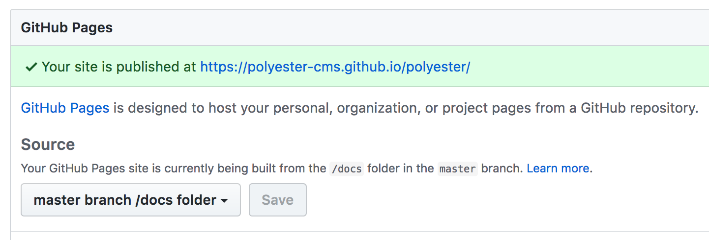

# Polyester

これは `Polymer` でできたバックエンドアプリケーションが不要な `CMS` です。


<small>Polymer は Google が開発している Web Components ベースのフロントエンドフレームワークです。</small>

### Markdown で書くだけ

ブログの記事は `Markdown` 形式で書くだけです。
この記事も `Markdown` で書かれています。

#### テーブル

テーブルだって使えます。

| 列1        | 列2          | 列3                 |
| ---------- |:------------:| ------------------- |
| なんとか   | かんとか     | できるよ            |
| だって     | Markdown     | GFMですもの         |

#### コードハイライト

コードハイライトには [Prism](http://prismjs.com/) を使っているので、対応言語であればコードハイライト可能です。

```php
<?php
echo "Hello Polyester CMS";
```

デフォルトで利用可能な言語は

* Markup - markup
* CSS - css
* C-like - clike
* JavaScript - javascript
* PHP - php
* Bash - bash
* CSS - css

なので、それ以外を使いたい場合は、`docs/elements/prismjs.html` に以下のようなHTMLを追加します。

```markup
<script src="../../bower_components/prism/components/prism-python.js"></script>
```

### 埋め込みタグも使える

以下のような Speaker Deck などの埋め込みタグも、もちろん使うことができます。

```html
<script async class="speakerdeck-embed" data-id="e504d71ff11648838f2fc27571719b8d" data-ratio="1.33333333333333" src="//speakerdeck.com/assets/embed.js"></script>
```

さらには Twitter の埋め込みタグだった、もちろん使うことができます。

```html
<blockquote class="twitter-tweet" data-lang="ja"><p lang="ja" dir="ltr">お花見ランチ (@ 新宿中央公園 in 新宿区, 東京都) <a href="https://t.co/3iPwz5voxN">https://t.co/3iPwz5voxN</a> <a href="https://t.co/Awg3HhGwz4">pic.twitter.com/Awg3HhGwz4</a></p>&mdash; しずひこ (@sizuhiko) <a href="https://twitter.com/sizuhiko/status/849841160558456832">2017年4月6日</a></blockquote>
<script async src="//platform.twitter.com/widgets.js" charset="utf-8"></script>
```

### スタイルのカスタマイズ

`docs/elements/polyester-prototype-app/polyester-theme.html` を編集します。

ほとんどの要素を `css` の変数として変更することができます。

```css
  /** ブログのタイトルバー部分 */
  --polyester-titlebar: {
    height: var(--polyester-header-height);
    background-image: url(../../images/top-opera3.jpg);
    background-position: right center;
    background-repeat: no-repeat;
  };
```

もちろん、すべては `HTML` でレイアウトが記述されているので、 `Polymer` を少しでも使ったことがあれば、それらを変更することも簡単でしょう。

### インストール方法

以下の手順で簡単に利用可能になります。

* このリポジトリを `Fork` する

#### リポジトリの設定を反映する

`docs/elements/polyester-prototype-app/polyester-prototype-app.html` を編集します。

83行目を変更して、`user` に GitHub のユーザー名を設定します。

```markup
<gh-articles user="あなたのGitHubユーザー名" repository="polyester" branch="master" directory="docs/source"></gh-articles>
```

105行目を変更して、GitHub のユーザー名を設定します。

```javascript
return {download_url: URI.expand('https://raw.githubusercontent.com/あなたのGitHubユーザー名/polyester/master/docs/source/{year}-{month}-{day}-{slug}.html.markdown', this.query)};
```

#### 公開する

* Fork したリポジトリの設定(`Settings`)で、`GitHub Pages` を有効にする
* 表示されたURLにアクセスする



### 記事を書く

`docs/source` に `Markdown` ファイルを設置して、ページをリロードすれば、自動的にページが読み込まれます。

ファイルの作成には、いくつかのルールがあります。

#### ファイル名のルール

`年-月-日-タイトル.html.markdown` のようなルールです。
例えば、このファイルは `2017-04-01-hellp-polyester-cms.html.markdown` という名前です。

#### ヘッダー部分

[Front-matter - jekyllrb](http://jekyllrb.com/docs/frontmatter/) で記述します。

例えば、この記事のヘッダー部分は以下のとおりです。

```
---
title: こんにちは Polyester CMS です
date: 2017-04-07 05:50 UTC
tags:
- Polyester
- CMS
- Polymer
- E1 GP
---
```

### さいごに

あとは、`images` ディレクトリに画像ファイルをアップロードしたり、`source` ディレクトリに記事を追加したり。。。
これらはすべて GitHub のサイト上から行うことができます。

ローカルや `TravisCI` などで `Markdown` を `HTML` に変換（ビルド）する必要はありません。

これで明日からブログを始めてみたくなりますね。